# AMX 多 Agent + GitHub + GitNexus 协同开发说明书

## 1. 文档目的

本文档定义 AMX 项目的多 Agent 协同开发体系，从设计原则、环境搭建、GitHub 治理、GitNexus 代码事实层、OCI 部署，到日常任务流和交付验收，形成一套可重复执行的工程协作规范。

当前开发验证和 GitNexus 成本控制的最新执行标准见 `docs/runbooks/development-verification-standard.md`。若本文档中的早期示例要求更频繁的全量测试、全量 E2E 或 GitNexus 查询，以该标准为准。

当前默认运行模式是 Codex 单 Agent 主执行，GitNexus 在关键节点提供代码证据，GitHub CI 做基础裁决，Antigravity/Gemini 和 Claude/Agent C 仅在明确需要时临时引入。若本文档中的早期示例描述三 Agent 常驻协作，以 `AGENTS.md`、`docs/runbooks/multi-agent-collaboration.md` 和 `docs/runbooks/development-verification-standard.md` 为准。

本体系服务于三个目标：

1. 让 Codex、Antigravity/Gemini、Claude/Agent C 在同一代码事实基础上协作。
2. 让 GitHub 成为唯一可信的代码、评审、CI、部署入口。
3. 让 GitNexus 成为所有 Agent 共享的代码图谱、影响分析和上下文压缩层。

本文档是总入口。具体规则仍以以下文件为执行依据：

- `AGENTS.md`
- `GEMINI.md`
- `CLAUDE.md`
- `docs/runbooks/multi-agent-collaboration.md`
- `docs/runbooks/gitnexus-agent-protocol.md`
- `docs/runbooks/github-governance.md`
- `docs/runbooks/oci-operations.md`
- `infra/gitnexus/README.md`

## 2. 总体架构

### 2.1 协同控制面

AMX 协同开发环境由四层组成：

| 层级 | 职责 | 主要组件 |
| --- | --- | --- |
| 人类决策层 | 产品范围、合并、发布、生产变更最终裁决 | Human owner |
| Agent 执行层 | 设计、实现、测试、评审、验收 | Codex、Antigravity/Gemini、Claude/Agent C |
| GitHub 治理层 | 代码源、任务、PR、CI、Release、Deploy workflow | GitHub Issues、Pull Requests、Actions、Labels、Environments |
| GitNexus 事实层 | 代码图谱、依赖关系、影响分析、上下文查询 | GitNexus CLI、GitNexus MCP、GitNexus server/web |

### 2.2 数据和决策流

```mermaid
flowchart LR
    A["Human requirement"] --> B["GitHub Issue / tasks inbox"]
    B --> C["Codex task decomposition"]
    C --> D["GitNexus impact and context query"]
    D --> E["Assigned agent branch"]
    E --> F["Implementation and local verification"]
    F --> G["Pull Request with evidence"]
    G --> H["CI and Collaboration governance checks"]
    H --> I["Claude/Agent C acceptance when needed"]
    I --> J["Codex technical review"]
    J --> K["Human merge decision"]
    K --> L["GitHub Actions deployment"]
    L --> M["OCI production/staging"]
    L --> N["GitNexus graph refresh"]
```



## 3. 设计原则

### 3.1 GitHub 是源代码和变更事实源

所有正式变更必须通过 GitHub 分支和 PR 进入主线。Agent 可以创建分支、提交、推送、开 PR 和填写证据，但不能绕过 CI、评审和人类合并控制。

### 3.2 GitNexus 是代码事实层，不是正确性证明

GitNexus 用于回答：

- 这个需求涉及哪些页面、API、服务、模型、worker 和测试？
- 是否已有可复用实现？
- 某个符号变化会影响哪些上游调用方？
- 当前 PR 的变更范围是否合理？

GitNexus 不替代：

- 类型检查；
- 单元测试；
- E2E 测试；
- 浏览器验证；
- 代码审查；
- 人类验收。

### 3.3 每个 Agent 独立工作区，避免共享脏树

统一根目录为：

```text
C:\amx
```

推荐工作区：

```text
C:\amx\AMX-main        main 分支和发布权威工作区
C:\amx\AMX-codex       Codex 架构、集成、审查、发布工作区
C:\amx\AMX-antigravity Antigravity/Gemini 实现和回归工作区
C:\amx\AMX-claude      Claude/Agent C 验收和文档工作区
C:\amx\gitnexus-data             GitNexus 本地数据
C:\amx\reports                   共享报告和交接产物
```

原则：一个 Agent 不编辑另一个 Agent 的工作树；一个任务一个分支；不在 `main` 上直接开发。

## 4. Agent 角色与边界

### 4.1 Codex / Agent A

定位：架构、任务拆分、技术审查、GitHub/OCI/GitNexus、发布和事故处理。

职责：

- 将人类需求拆成可执行任务。
- 判断任务边界、PR 粒度和风险。
- 查询 GitNexus 识别影响范围。
- 审查后端、数据库、worker、部署、CI 和安全风险。
- 协调 staging/production 部署和回滚。

必须使用 GitNexus 的场景：

- 任务拆分前；
- 架构设计前；
- 技术审查前；
- CI、staging、production 故障诊断时；
- 发布和回滚计划前。

### 4.2 Antigravity / Gemini / Agent B

定位：主要实现和回归测试 Agent。

职责：

- 在指定分支实现功能。
- 编写或修复测试。
- 运行类型检查、构建、单元测试、E2E。
- 提交 PR 并填写完整证据。

必须使用 GitNexus 的场景：

- 开始编码前查找已有实现和测试。
- 修改完成后做变更影响分析。
- PR 报告中说明 GitNexus 结果如何影响测试选择。

### 4.3 Claude / Agent C

定位：业务验收、中文文档、用户体验和产品评审 Agent。

职责：

- 验证用户流程是否真实可用。
- 评审中文文案、交互、业务闭环。
- 从代码事实生成操作手册、验收报告。
- 给出 `PASSED`、`BLOCKED` 或 `PASSED_WITH_FOLLOW_UPS`。

必须使用 GitNexus 的场景：

- 业务验收前；
- 编写用户手册前；
- 评审用户可见页面和功能链路前；
- 检查页面到 API 到服务到数据表是否闭环时。

## 5. GitHub 治理设计

### 5.1 分支模型

| 分支 | 用途 |
| --- | --- |
| `main` | 生产就绪主线 |
| `feature/v0.x.0` | 某个版本的开发列车 |
| `feature/v0.x.0-*` | 某个 Agent 或功能任务分支 |
| `fix/*` | 缺陷修复 |
| `infra/*` | 基础设施、部署、治理变更 |
| `docs/*` | 文档和说明书 |
| `release/v0.x.0` | 发布稳定分支 |
| `hotfix/v0.x.y` | 生产紧急修复 |

### 5.2 Issue 入口

正式任务优先使用 GitHub Issue。Agent 任务模板要求填写：

- 目标 Agent；
- 目标和验收标准；
- 不可触碰的文件、分支、密钥、环境；
- base branch；
- GitNexus 查询目标；
- 必须执行的验证命令；
- 验收角色。

未成熟需求可先进入：

```text
tasks/inbox.md
```

### 5.3 PR 证据要求

每个 PR 必须包含：

- Purpose；
- Scope；
- Evidence；
- Risk And Rollback；
- Agent Attribution；
- GitNexus Impact Record。

`Collaboration governance` workflow 会自动检查 PR 是否包含 Agent Attribution 和 GitNexus evidence。它不是 branch protection 的替代品，但能阻止空洞 PR 进入评审。

### 5.4 CI 和治理检查

当前主要 GitHub Actions：

| Workflow | 作用 |
| --- | --- |
| `CI` | API tests、Web typecheck/build、Docker Compose config |
| `Collaboration governance` | PR 证据、Agent 协议文件完整性检查 |
| `Deploy staging` | 从指定分支部署 staging |
| `Deploy production` | 从 `main` 或 release ref 部署生产 |
| `Release` | 版本发布校验 |

### 5.5 当前 GitHub 平台保护

当前正式仓库为 Public 仓库，GitHub Free 支持正式保护。必须启用：

- `main` branch protection；
- required reviews；
- CODEOWNERS review；
- required checks；
- production environment reviewers。

同时保留：

- PR-only 流程纪律；
- CI；
- Collaboration governance；
- 人类合并控制；
- Codex 发布协调。

## 6. GitNexus 设计与接入

### 6.1 定位

GitNexus 是代码事实和影响分析层。它为 Agent 提供同一份代码图谱，避免每个 Agent 只靠局部文件搜索和上下文猜测。

当前使用正式 GitNexus 产品能力，不使用 lite 替代方案。

### 6.2 主要接口

| 接口 | 用途 |
| --- | --- |
| CLI | 本地查询、索引、影响分析 |
| MCP | Codex/Claude/Gemini 等 Agent 工具接入 |
| Server HTTP API | 内部服务和 AMX provider 接入 |
| Web UI | 人类查看图谱和演示 |

### 6.3 OCI 部署形态

GitNexus 在 OCI 内部部署：

```text
/home/ubuntu/amx/gitnexus/
```

服务绑定：

```text
GitNexus server: 127.0.0.1:4747
GitNexus web:    127.0.0.1:4173
```

容器镜像：

```text
ghcr.io/abhigyanpatwari/gitnexus
ghcr.io/abhigyanpatwari/gitnexus-web
```

原则：默认不公网暴露 GitNexus。若未来需要外部访问，应放在认证、Cloudflare Access、限流和审计之后。

### 6.4 本地安装与 MCP

Windows 本地配置：

```powershell
powershell -ExecutionPolicy Bypass -File infra\scripts\setup-gitnexus-mcp.ps1 `
  -RepoPath C:\amx\AMX-main
```

Codex MCP 配置位于：

```text
%USERPROFILE%\.codex\config.toml
```

配置形态：

```toml
[mcp_servers.gitnexus]
command = "npx"
args = ["-y", "--registry=https://registry.npmmirror.com", "gitnexus@latest", "mcp"]
```

Codex 需要重启后加载 MCP server。

### 6.5 Agent 必须记录的 GitNexus 信息

每次任务或 PR 至少记录：

```text
GitNexus repository:
Indexed commit:
Current commit:
Status:
Commands or MCP tools used:
Result summary:
Fallback if unavailable:
```

不能只写“已检查 GitNexus”。

## 7. OCI 与部署设计

### 7.1 目录结构

```text
/home/ubuntu/amx/
  production/ConsultantAIP/
  staging/<slot>/
  gitnexus/
  backups/
  logs/
```

当前兼容路径：

```text
/home/ubuntu/ConsultantAIP
```

### 7.2 生产部署

生产部署通过 GitHub Actions：

```powershell
gh workflow run "Deploy production" -f ref=main
gh run watch <run_id> --interval 10 --exit-status
```

部署过程：

1. GitHub runner 通过 SSH 登录 OCI。
2. OCI 拉取指定 ref。
3. 执行 `infra/deploy/deploy-oci.sh`。
4. 执行生产健康检查。
5. 部署或刷新 GitNexus。
6. GitNexus 重新索引 `main`。

### 7.3 生产健康检查

AMX 生产健康检查：

```bash
curl -fsS https://amx.yuanda.win/health
```

期望：

```json
{"status":"healthy","version":"1.0.0"}
```

GitNexus 健康检查：

```bash
cd /home/ubuntu/amx/gitnexus
docker compose ps
curl -fsS http://127.0.0.1:4747/api/health
docker compose exec -T gitnexus-server gitnexus list
```

## 8. 从零搭建步骤

### 8.1 本地基础目录

```powershell
New-Item -ItemType Directory -Force C:\amx
New-Item -ItemType Directory -Force C:\amx\reports
```

克隆主仓库：

```powershell
git clone https://github.com/BizYan/AMX.git C:\amx\AMX-main
cd C:\amx\AMX-main
```

建议为 Agent 准备独立工作区：

```powershell
git clone https://github.com/BizYan/AMX.git C:\amx\AMX-codex
git clone https://github.com/BizYan/AMX.git C:\amx\AMX-antigravity
git clone https://github.com/BizYan/AMX.git C:\amx\AMX-claude
```

也可以使用 `git worktree`，但必须保证每个 Agent 独立工作树。

### 8.2 GitHub CLI

安装并登录：

```powershell
gh auth login
gh auth status
```

需要权限：

- `repo`
- `workflow`
- `read:org` 如需组织信息；
- 其他按 GitHub CLI 提示授权。

### 8.3 GitNexus 本地初始化

```powershell
cd C:\amx\AMX-main
powershell -ExecutionPolicy Bypass -File infra\scripts\setup-gitnexus-mcp.ps1 `
  -RepoPath C:\amx\AMX-main
gitnexus status
```

若 stale：

```powershell
gitnexus analyze --index-only
```

### 8.4 GitHub 仓库治理初始化

必须确认：

```powershell
gh label list --limit 100
gh workflow list
gh api repos/BizYan/AMX/environments
```

必备 labels：

- `agent-task`
- `agent-codex`
- `agent-antigravity`
- `agent-claude`
- `gitnexus-required`
- `needs-acceptance`
- `infra`

必备 environments：

- `staging`
- `production`

### 8.5 OCI GitNexus 部署

在 OCI：

```bash
cd /home/ubuntu/amx/production/ConsultantAIP
bash infra/deploy/deploy-gitnexus.sh
```

刷新图谱：

```bash
bash infra/deploy/refresh-gitnexus.sh
```

### 8.6 协同健康检查

Windows：

```powershell
cd C:\amx\AMX-main
powershell -ExecutionPolicy Bypass -File infra\scripts\check-agent-collaboration.ps1 `
  -RepoPath C:\amx\AMX-main `
  -RefreshIfStale
```

OCI/Linux：

```bash
REPO_PATH=/home/ubuntu/ConsultantAIP REPORTS_DIR=/home/ubuntu/amx/reports \
  REFRESH_IF_STALE=1 bash infra/scripts/check-agent-collaboration.sh
```

报告输出到：

```text
C:\amx\reports
/home/ubuntu/amx/reports
```

## 9. 日常协同流程

### 9.1 需求进入

1. 人类在 GitHub Issue 创建 `Agent task`。
2. 若需求还不成熟，先写入 `tasks/inbox.md`。
3. Codex 读取需求并执行 GitNexus 查询。
4. Codex 拆分任务并指定 Agent。

### 9.2 开发前

Agent 必须：

```powershell
git fetch origin --prune
git switch -c <branch-name> origin/main
gitnexus status
```

若 stale：

```powershell
gitnexus analyze --index-only
```

查询已有实现：

```powershell
gitnexus query "<task>" --goal "find reusable implementation and tests" --limit 10
```

### 9.3 开发中

要求：

- 优先复用现有组件、API client、service、schema、测试模式。
- 不提交 `.env`、密钥、浏览器 profile、生成 token。
- 不在同一 PR 混入无关重构。
- 不交付无反馈按钮、死链接、空白页。

### 9.4 PR 前

至少执行：

```powershell
gitnexus analyze --index-only
gitnexus detect-changes --scope compare --base-ref main --repo "<absolute-current-worktree-path>"
```

按变更类型执行验证：

```powershell
pnpm --dir apps/web typecheck
pnpm --dir apps/web build
uv run --directory apps/api pytest
docker compose -f infra/docker-compose.yml config
```

前端交互变更还要运行 Playwright 或浏览器验证。

### 9.5 PR 评审

PR 必须填写：

- 变更目的；
- 范围；
- 命令证据；
- 风险和回滚；
- Agent 归属；
- GitNexus 影响记录。

Claude/Agent C 对用户可见变更做业务验收。Codex 做技术、架构、风险和发布审查。

### 9.6 合并与部署

合并到 `main` 后：

1. GitHub Actions 生产部署可由人类或授权发布流程触发。
2. 部署成功后自动刷新 GitNexus。
3. 需要核验 AMX health 和 GitNexus health。

## 10. 常用命令清单

### 10.1 GitNexus

```powershell
gitnexus list
gitnexus status
gitnexus analyze --index-only
gitnexus query "project invitation flow" --goal "find frontend, API, service, models, and tests" --limit 8
gitnexus context create_project --file apps/api/app/domains/projects/service.py
gitnexus impact ProjectService --direction upstream --depth 3 --include-tests
gitnexus detect-changes --scope compare --base-ref main --repo "<absolute-current-worktree-path>"
```

### 10.2 GitHub

```powershell
gh auth status
gh pr list
gh pr checks <number> --watch --interval 10
gh pr merge <number> --merge --delete-branch
gh workflow run "Deploy production" -f ref=main
gh run watch <run_id> --interval 10 --exit-status
```

### 10.3 OCI

```powershell
ssh -i "<PATH_TO_OCI_SSH_KEY>" ubuntu@<OCI_HOST>
```

```bash
cd /home/ubuntu/ConsultantAIP
git log -1 --oneline
git status --short --branch
curl -fsS https://amx.yuanda.win/health
```

## 11. 验收标准

协同环境完整可用应满足：

1. `C:\amx` 下存在主工作区和各 Agent 独立工作区。
2. GitHub CLI 已登录且可推送分支、创建 PR、触发 workflow。
3. GitNexus CLI 可用，`gitnexus status` 与当前 commit 一致。
4. Codex MCP 配置包含 GitNexus server。
5. GitHub labels、issue templates、PR template、CI 和 Collaboration governance workflow 存在。
6. OCI 可通过 GitHub Actions 部署。
7. `https://amx.yuanda.win/health` 返回 healthy。
8. OCI GitNexus server/web healthy，且索引 main。
9. PR 不能缺少 Agent Attribution 和 GitNexus Impact Record。
10. Agent 产出的报告包含命令证据、风险、回滚、GitNexus 查询记录。

## 12. 已知制约与处理策略

### 12.1 GitHub Public 仓库保护

当前 Public 仓库必须启用 branch protection、required checks 和 production
environment protection。PR 流程纪律、CI、Collaboration governance 和人类发布
控制继续作为补充保护，不能替代平台规则。

### 12.2 GitNexus 不能替代测试

GitNexus 只能证明“查过代码事实”和“影响范围分析过”，不能证明功能正确。所有 PR 仍必须有测试和人工审查。

### 12.3 旧工作区清理

旧目录如 `C:\ConsultantAIP`、`C:\ConsultantAIP_antigravity`、`C:\ConsultantAIP_push_tmp` 不应直接删除。应先生成差异报告，迁移独有文档和补丁，再归档或删除。

## 13. 后续完善路线

1. 升级 GitHub 计划或调整仓库可见性后启用 branch protection。
2. 为 production environment 增加 reviewer approval。
3. 注册 GitNexus 为 AMX 内部 provider，使用真实 service key。
4. 为 PR 分支建立更细粒度的 GitNexus 临时图谱刷新策略。
5. 将 Agent 任务状态同步到 GitHub Projects 或 AMX 内部任务台。
6. 增加自动化报表：每个版本的任务、PR、GitNexus 影响、测试、部署和验收摘要。

## 14. 新 Agent 会话启动清单

新会话开始后必须执行：

```powershell
cd C:\amx\AMX-main
git fetch origin --prune
git status -sb
gitnexus status
```

然后阅读：

```text
AGENTS.md
GEMINI.md 或 CLAUDE.md
docs/runbooks/gitnexus-agent-protocol.md
docs/runbooks/multi-agent-collaboration.md
```

最后根据任务类型执行：

```powershell
gitnexus query "<task or user flow>" --goal "find routes, APIs, services, data models, workers, and tests" --limit 10
```

没有完成上述步骤，不应开始编码、评审或验收。
