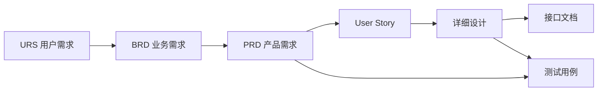

# Avenir Matrix 系统升级设计手册

## 1. 背景与目标

本手册基于 2026-05-21 产品试用反馈、当前前端页面与后端代码能力梳理形成，目标是把 Avenir Matrix 从“可生成文档的项目工具”升级为“面向咨询交付的人机协同项目文档操作系统”。

产品定位应从单点文档生成转向完整交付链路：

- 以项目为交付边界。
- 以文档为核心资产。
- 以模板定义交付物结构。
- 以 Skill 和 Agent 组织专业生成能力。
- 以版本、评审、发布、追溯和变更管理保证交付质量。
- 以 Human-in-the-Loop 审批机制控制 AI 对关键交付物的影响。

## 2. 当前系统能力基线

### 2.1 已具备的后端基础

当前代码中已经具备以下关键模型和服务基础：

- 项目与成员：`Project`、`ProjectMember`、`ProjectInvitation`
- 项目资料：`SourceFile`
- 文档：`Document`
- 文档实体：`DocumentEntity`
- 文档版本：`DocumentVersion`
- 文档基线：`DocumentBaseline`
- 文档质量结果：`QualityResult`
- 文档评论：`DocumentComment`
- 文档快照：`DocumentSnapshot`
- 模板：`Template`
- 模板版本：`TemplateVersion`
- 工作流定义：`WorkflowDefinition`
- 工作流版本：`WorkflowVersion`
- Agent 运行：`AgentRun`
- Agent 任务：`AgentTask`
- Agent 事件：`AgentEvent`
- 知识条目与知识图谱基础
- 变更请求与追溯矩阵基础

### 2.2 已覆盖的文档类型

当前系统已有以下文档类型：

- URS：用户需求规格说明书
- BRD：业务需求说明书
- PRD：产品需求说明书
- User Story：用户故事
- Detailed Design：详细设计
- Interface：接口文档
- Data Dictionary：数据字典
- Test Case：测试用例

这些类型已经能支撑咨询交付中从需求到测试的主干链路。

### 2.3 当前主要断点

当前系统的问题不是完全缺少基础能力，而是基础能力尚未组成产品闭环：

- 项目与文档在信息架构上仍然割裂。
- 文档生成偏一次性，不支持持续对话式完善。
- 模板还不是章节级、对象级的交付物定义。
- Skill 与 Agent 尚未形成面向 URS/BRD/PRD 的专业编排。
- 版本、快照、基线、回滚、评论等能力存在，但前端体验不完整。
- 发布态文档与下游引用的规则尚未形成强约束。
- 上下游影响分析和同步机制尚未产品化。
- 部分页面仍有英文、按钮不可用、空状态不明确等体验问题。

## 3. 升级后的核心产品架构

### 3.1 一级业务主线

建议把产品主线调整为：

1. 项目文档
2. 知识图谱
3. 智能体
4. 模板中心
5. 变更与追溯
6. 团队与权限
7. 系统监控
8. 设置

其中“项目文档”应成为核心一级入口，合并当前“项目”和“文档”的主要功能。全局文档列表可以保留为高级检索视图，但不应作为主要工作入口。

### 3.2 项目文档域

项目文档域负责管理一个项目内的所有交付资产：

- 项目基础信息
- 项目成员
- 项目资料上传
- 项目知识库
- 项目文档列表
- 文档生成
- 文档编辑
- 文档评审
- 文档版本
- 文档发布
- 文档追溯
- 项目变更请求

约束规则：

- 每个文档必须且只能属于一个项目。
- 每个项目可以定义自己的文档状态流。
- 每个项目可以选择标准模板，也可以创建项目级模板变体。
- 项目内文档按类型、状态、版本、负责人、更新时间组织。

### 3.3 模板域

模板不应只是文件上传或简单文本，而应升级为交付物结构定义。

模板对象建议包含：

- 模板名称
- 文档类型
- 适用行业
- 适用项目类型
- 版本
- 状态
- 章节树
- 章节内容要求
- 章节输入字段
- 章节质量规则
- 章节绑定 Skill
- 章节提示词
- 章节引用规则

标准模板：

- 标准 URS 模板
- 标准 BRD 模板
- 标准 PRD 模板
- 标准 User Story 模板
- 标准 Test Case 模板

项目级模板：

- 必须基于标准模板复制生成。
- 允许增删章节。
- 允许调整 1 至 3 级目录名称。
- 允许覆盖章节提示词。
- 允许绑定不同 Skill 组合。
- 允许设置项目级质量规则。

### 3.4 Skill 域

Skill 是 Agent 执行能力的最小专业单元。建议分为三类：

#### 扩散类 Skill

用于基于不完整输入进行需求挖掘和问题澄清。

典型能力：

- 根据只言片语扩展业务背景。
- 生成澄清问题。
- 识别缺失要素。
- 补全角色、场景、边界、约束。
- 将模糊描述转成结构化需求候选。

#### 专业类 Skill

用于特定行业或专业领域的解释、归纳和判断。

典型领域：

- 物流
- 金融
- 电商
- 制造
- 能源
- 政企信息化
- 供应链
- 数据治理
- 企业架构

典型能力：

- 行业术语解释。
- 行业流程映射。
- 专业约束识别。
- 监管或合规要点提示。
- 行业最佳实践补全。

#### 内部知识库类 Skill

用于基于企业内部知识生成和解释。

典型能力：

- 从项目资料中检索上下文。
- 从历史交付件中复用结构和措辞。
- 基于内部术语库统一表达。
- 基于内部案例补充专业内容。
- 引用来源并形成可追溯证据链。

### 3.5 Agent 域

Agent 应按文档类型和任务目标组织，而不是只有一个通用生成器。

建议内置 Agent：

- URS 编写 Agent
- BRD 编写 Agent
- PRD 编写 Agent
- User Story 拆解 Agent
- Test Case 生成 Agent
- 需求澄清 Agent
- 文档评审 Agent
- 一致性检查 Agent
- 追溯分析 Agent
- 变更影响分析 Agent

每个 Agent 应包含：

- 目标文档类型
- 输入要求
- 输出结构
- 默认模板
- Skill 组合
- 工具组合
- 执行流程
- 质量门禁
- 人工确认节点

示例：URS 编写 Agent

- 输入：项目背景、干系人、业务目标、资料文件、用户描述。
- Skill：扩散类需求挖掘、行业专业 Skill、内部知识库 Skill。
- 输出：结构化 URS。
- 人工节点：需求澄清确认、章节确认、发布确认。

### 3.6 文档生命周期域

文档不是一次性生成物，而是持续演进的交付资产。

建议生命周期：

1. 草稿
2. 编写中
3. 待评审
4. 评审中
5. 待修订
6. 已批准
7. 已发布
8. 已归档

核心规则：

- 草稿和编写中版本不可被下游正式引用。
- 待评审状态可以被评审人评论，但不可发布。
- 已批准可进入发布。
- 已发布才可作为下游文档引用依据。
- 已归档文档只读。

项目可自定义状态：

- 可以增减状态名称。
- 必须保留系统语义状态映射。
- 每个状态应定义允许动作、可操作角色和下一个状态。

### 3.7 对话式文档编写

文档编写应支持持续对话，而不是一次性提交需求后生成。

建议交互模式：

- 左侧：文档结构树
- 中间：文档正文
- 右侧：AI 协作面板
- 底部或侧边：版本、评论、引用、影响分析

对话能力：

- 继续完善当前章节。
- 针对选中文本改写。
- 根据评论修订。
- 根据资料补充证据。
- 根据上游文档补齐内容。
- 根据模板规则检查缺口。
- 保存为新版本。

### 3.8 版本与自动保存

建议同时保留三种版本概念：

#### 自动快照

- 系统后台定时保存。
- 建议默认 5 分钟一次。
- 用于防止内容丢失。
- 不进入正式版本号序列。

#### 手动版本

- 用户点击“保存版本”生成。
- 使用 V1、V2、V3 等业务版本号。
- 可填写变更说明。
- 可回退。

#### 发布基线

- 发布时创建不可变基线。
- 用于下游引用、审计和追溯。
- 回滚时必须生成新的版本记录。

### 3.9 评审与评论

文档评审应支持基于标注的评论。

评论对象：

- 整篇文档
- 指定章节
- 指定段落
- 指定表格
- 指定需求项

评论状态：

- 未解决
- 已答复
- 已解决
- 已驳回

核心规则：

- 评论必须保留作者、时间、关联位置。
- 作者可以回复评论。
- 文档负责人可以标记解决。
- 评审意见解决情况应影响文档是否可批准。

### 3.10 发布与下游引用

发布是交付物进入正式引用链的分界点。

规则：

- 未发布文档不可被下游正式引用。
- 已发布文档可被下游文档引用。
- 下游引用必须记录引用的文档版本或发布基线。
- 上游发布新版本时，下游应收到影响提醒。

### 3.11 上下游追溯与同步

建议建立从 URS 到 Test Case 的血缘链：

同步机制不应直接静默修改下游文档，而应采用审批式同步：

1. 上游文档发生变更。
2. 系统识别受影响文档和章节。
3. Agent 生成变更影响分析。
4. Agent 生成候选修订内容。
5. 负责人审核。
6. 审核通过后应用修订。
7. 生成新版本。
8. 更新追溯关系。

### 3.12 变更影响分析

变更影响分析应回答：

- 哪些下游文档受影响？
- 哪些章节或需求项受影响？
- 影响等级是什么？
- 是否需要同步修改？
- 建议修改内容是什么？
- 是否影响已发布基线？
- 是否需要重新评审？

影响等级：

- P0：阻断交付，必须处理。
- P1：影响核心内容，应处理。
- P2：影响局部描述，可计划处理。
- P3：仅提示，无需立即处理。

## 4. 角色与权限设计

### 4.1 系统管理员

负责：

- 租户配置
- 用户与角色管理
- API 密钥管理
- 系统监控
- 模型供应商配置
- 全局模板维护

### 4.2 项目负责人

负责：

- 创建项目
- 配置项目模板
- 管理项目成员
- 定义项目状态流
- 审批关键文档
- 发布基线
- 处理变更影响

### 4.3 资深顾问 / 架构师

负责：

- 编写和修订核心文档
- 使用 Agent 生成交付物
- 审核 AI 输出
- 维护上下游关系
- 处理评审意见

### 4.4 文档作者

负责：

- 录入需求
- 生成文档草稿
- 对话式完善章节
- 保存版本
- 回复评论

### 4.5 评审人

负责：

- 查看待评审文档
- 标注文档问题
- 发表评审意见
- 确认问题解决情况

### 4.6 查看者

负责：

- 查看已授权项目和文档
- 查看已发布交付物
- 查看追溯关系
- 导出允许范围内的文档

## 5. 关键页面升级设计

### 5.1 项目文档首页

替代当前割裂的“项目”和“文档”入口。

应展示：

- 项目列表
- 项目文档数量
- 进行中文档
- 待评审文档
- 已发布文档
- 最近变更
- 风险提示

### 5.2 项目工作台

项目内统一入口：

- 概览
- 资料
- 文档
- 知识库
- 追溯
- 变更
- 成员
- 设置

### 5.3 文档列表页

应支持：

- 按文档类型分组。
- 按状态筛选。
- 按版本筛选。
- 查看修订历史。
- 查看当前状态。
- 查看引用关系。
- 查看待处理评论。

### 5.4 文档编辑页

应支持：

- 文档结构树。
- 正文编辑。
- AI 对话协作。
- 评论标注。
- 版本保存。
- 自动保存状态。
- 发布前检查。
- 影响分析。

### 5.5 模板中心

应支持：

- 标准模板库。
- 项目模板库。
- 模板复制。
- 模板版本。
- 章节树编辑。
- 章节提示词配置。
- 章节 Skill 绑定。
- 模板预览。

### 5.6 智能体中心

应支持：

- Agent 列表。
- Agent 类型。
- 绑定文档类型。
- Skill 组合。
- 运行历史。
- 失败重试。
- 执行日志。

### 5.7 追溯中心

应支持：

- URS 到 Test Case 的矩阵。
- 文档血缘图。
- 变更影响分析。
- 缺失关系检查。
- 导出追溯报告。

## 6. 非功能要求

### 6.1 审计

必须记录：

- 登录
- 文档创建
- 文档修改
- 版本保存
- 评论
- 评论解决
- 状态流转
- 发布
- 回滚
- 导出
- Agent 运行
- 模板修改

### 6.2 安全

必须保证：

- 租户隔离。
- 项目权限隔离。
- 文档权限隔离。
- API 密钥最小权限。
- 发布基线不可被直接修改。

### 6.3 可解释性

AI 生成内容应尽可能保留：

- 输入来源。
- 知识来源。
- 模板来源。
- 使用的 Skill。
- 使用的 Agent。
- 生成时间。
- 生成参数。

### 6.4 可用性

必须消除：

- 空白页。
- 404 跳转。
- 按钮无反应。
- 中英文混杂。
- 黑色字体在深色背景不可见。
- 上传无反馈。
- 导出无反馈。
- 版本历史为空但无解释。

## 7. 推荐落地路线

推荐按四个阶段落地：

1. 稳定现有体验。
2. 重构项目文档主线。
3. 升级模板、Skill、Agent 编排。
4. 建设发布、追溯、影响分析与审批式同步。

优先级原则：

- 先修可信度，再做智能化。
- 先打通业务闭环，再扩展高级能力。
- 先 Human-in-the-Loop，再自动同步。
- 先项目级闭环，再租户级平台化。
